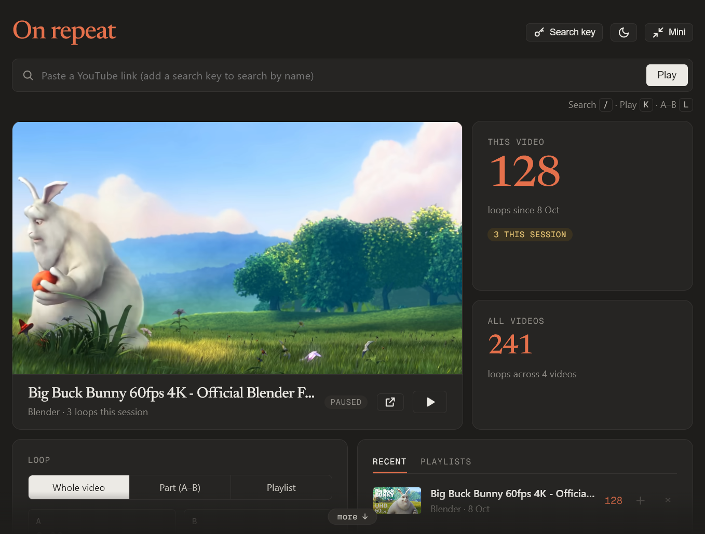
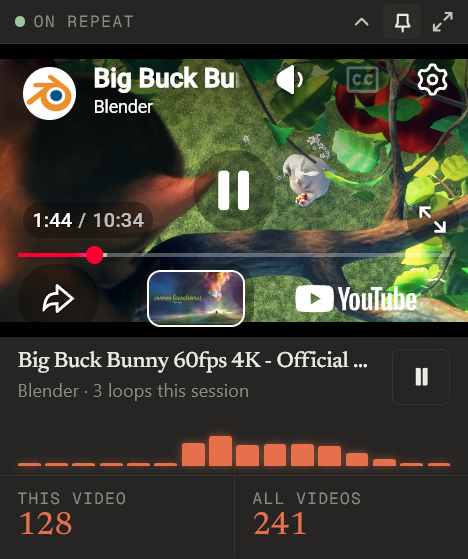
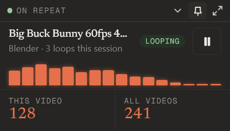
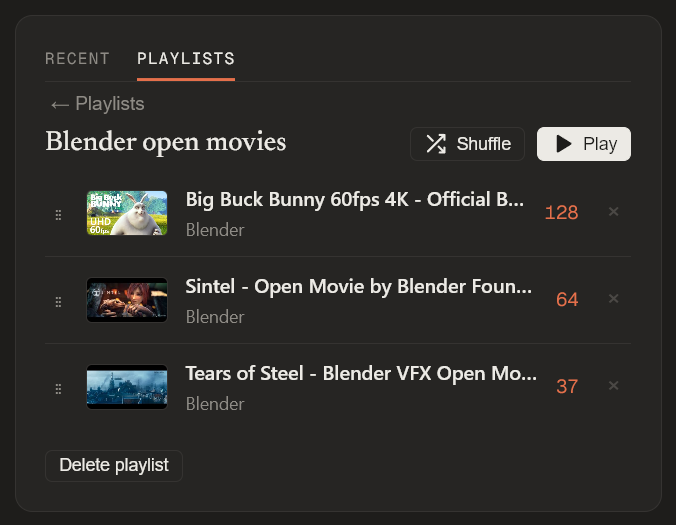

# On repeat — desktop

A standalone Windows app that loops YouTube videos and keeps a lifetime listen
count. **Needs no server**: the page, the counts and the search all live in the
app on this PC. **[Download the latest release](https://github.com/betemonkey/repeat-desktop/releases/latest)**.



<p>
  
  &nbsp;
  
</p>

*The mini window floats over everything. Fold it to keep just the title, the
music bars (they follow the actual sound) and your counts.*



*Screenshots use the Blender Foundation's open movies.*

It started as a `/repeat` page on the monkey-status NAS dashboard (designs in the
monkeynas repo, `ui-mockups/youtube-repeat*.html`). It became an app because a
browser couldn't do what Monkey wanted from the pop-out: Firefox draws its
address bar on page pop-outs, Orca's built-in browser closes them instantly, and
two players in two windows had to hand progress and counts back and forth. Then
it dropped the NAS too (Monkey, 2026-10-07: "not something that require the nas").

## What it does

| Mode | Window |
|---|---|
| Full | normal Windows frame, resizable: paste a link (or search), loop the whole video or an A–B part, counts, recent |
| Mini | 320 px wide, no frame, rounded corners, always on top (pin button), dragged by its top strip |
| Mini, folded | the video hidden (still playing): title, play/pause, progress, counters |

The ↗↙ button (or Esc) in the mini strip goes back to the full window. Closing the
full window quits. "Open on YouTube" and the guide's links open in the default
browser. On start it plays the last video you played.

**Listen count:** a loop counts when the video reaches its end (or B in part
mode); dragging back to the start does not. The × on a Recent row removes that
video and its loops from the total, with Undo for 8 seconds.

**Playlists (Monkey's pick "P2", 2026-10-08, `mockups/playlist-options.html`):**
your own lists, kept in `%APPDATA%\RepeatDesktop\playlists.json` beside the
counts. The **+** on a Recent or search row adds a song ("Add to…", or a new
list from the same menu); the Playlists tab lists them; inside one you can play,
shuffle, drag rows to reorder, remove a song or delete the list (both with
Undo), and click the name to rename it. The Loop card's **Playlist** mode plays
the list in order and starts again from the first after the last. A song counts
when it plays to its end; skipping with ⏭ doesn't count. The mini window shows
⏮ ⏭ and "3 / 12" while a playlist plays. Picking one video yourself (paste,
Recent, search) leaves Playlist mode; the app reopens on the playlist where it
was. Counts are never stored in a playlist: a song's loops are the same
whichever list played it.

**Music bars (mini window):** 16 orange bars that follow the actual sound, like
the Stream Deck Spotify knob (same capture and feel, ported from
`streamdeck/spotifyviz`). Windows' per-app audio capture listens to WebView2's
browser process tree only, so it hears this window's video and nothing else on
the PC, and only while the mini window is showing. Pointed at the app's own
process it heard silence; WebView2's browser process is the root that works.

**Look (Monkey's picks, 2026-10-08, `mockups/look-options.html`):** A3, no
scroll bar, with the page edges fading and a "more ↓" chip where there's more
(they stand down wherever they would touch the player); B2, in dark mode the
heading and every number in the icon's orange; C1, the bars above, with
play/pause spanning the song name and description.

## Install

Download the zip from the [latest release](https://github.com/betemonkey/repeat-desktop/releases/latest),
unzip it anywhere and run `OnRepeat\RepeatDesktop.exe`. .NET is built in; Microsoft
WebView2 comes with Windows 11. The .exe isn't signed, so the first run shows
"Windows protected your PC": choose **More info → Run anyway**.

## Run from source

```
dotnet build -c Release
bin\Release\net9.0-windows\RepeatDesktop.exe
```

Needs the .NET 9 runtime and Microsoft's WebView2 runtime (ships with Windows 11).

## Where things are kept (this PC only)

| What | Where |
|---|---|
| Counts, last played, recent | `%APPDATA%\RepeatDesktop\repeat-counts.json` |
| Window positions, pin, YouTube key | `%APPDATA%\RepeatDesktop\settings.json` |
| The page's own memory (A–B points, theme, fold) | WebView2 profile, `%LOCALAPPDATA%\RepeatDesktop\WebView2` |

`REPEAT_DESKTOP_DATA=<folder>` moves all three somewhere else; the checks use it
so they never touch the real counts.

## Search

Pasting a link always works. Searching by name needs a free **YouTube Data API v3**
key of your own: press **Search key** in the app, follow the six steps there, paste
the key. The app checks the key with Google before saving it. Free quota is
10,000 units a day; a search costs 100, so about 100 searches a day.

## How it's built

- `wwwroot/repeat.html`: the page (layout D). It's served from a made-up https
  origin, `https://on-repeat.example`, answered entirely inside the app. The origin
  must be https because YouTube refuses embeds from pages that send no referrer.
- `RepeatApi.cs`: the page's backend (`/api/repeat`, `/api/repeat-count`,
  `/api/repeat-played`, `/api/ytinfo`, `/api/ytsearch`, `/api/settings`). Same
  routes and rules the NAS version had: a loop adds a small positive step (≤ 500),
  a play adds nothing but stamps the order, the total is always the sum, and a
  damaged counts file is reported, never overwritten.
- `MainForm.cs`: the window. The page posts `mode` / `height` / `pin` / `drag`;
  the window changes frame, size, position and always-on-top. Heights come in
  device pixels from the page, because WebView2 applies Windows' *Text size*
  setting on top of the screen's DPI.

## Checks

See also `TESTING.md`: the manual checklist, the defects found so far, and the
house preferences.


```
dotnet build -c Release
node tests/check.js
```

Starts the app on a throwaway data folder, runs 34 checks over WebView2's
DevTools port (counting rules, refused inputs, 8 parallel tabs × 25 loops, search
without a key, a wrong key refused by Google, the key guide, oEmbed titles, a
damaged counts file), and closes it. Needs internet for the YouTube parts.

## Security

Reviewed 2026-10-08; the checks cover each point.

- **Only the app's own page can use its API.** A random secret is made at each
  start, written into the page as it's served, and required on every API call.
  Calls without it get 403 and change nothing. YouTube's embedded frame can't
  reach the API at all: measured, its requests fail before they get here.
- **The window can't be taken elsewhere.** Navigation outside the app's page is
  cancelled. A link you click opens in your default browser (http/https only),
  and pop-ups you didn't click are dropped. Page-to-window messages are accepted
  only from the app's page.
- **Everything from YouTube is escaped** before it's shown (titles, channels),
  as are playlist names. Video ids are checked against YouTube's 11-character
  format on both sides.
- **Data files** are written atomically. A damaged counts or playlists file is
  reported and never overwritten.
- **Audio capture** listens to WebView2's own process tree only, and only while
  the mini window is showing.
- **Known and accepted:** the YouTube API key is stored as plain text in
  `%APPDATA%\RepeatDesktop\settings.json` (your user profile only). It's a free
  key that you can, and should, restrict to the YouTube Data API v3 (step 5 of
  the in-app guide).
- **Known and accepted:** the .exe isn't code-signed, so Windows SmartScreen
  warns on first run.

## Folding and YouTube's rules

YouTube's embed rules say a player must be at least 200×200 px. Folding hides
it entirely. That's Monkey's call (2026-10-07). The video keeps playing while
folded (checked: 7.1 → 10.1 s over 3 s).
